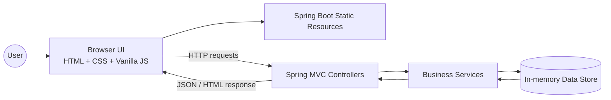
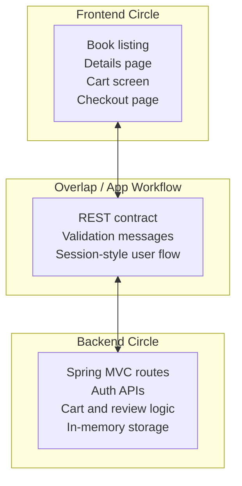

# Glowlogics Book Store

A mini online bookstore app that demonstrates a complete **frontend + backend** web workflow using **Vanilla JS + Spring Boot**.

It supports book browsing, book details, cart management, checkout simulation, authentication, and reviews.

> Note: The backend uses **in-memory data structures**, so **no database setup** is required.<br>
> live link : https://glowlogics-book-store.onrender.com<br>
> github clone link : https://github.com/kupendrav/Glowlogics-Book-Store.git

---

## ✨ Features

- Browse books (listing, search, category filtering)
- View book details (description, price, image, reviews)
- Cart management (add/remove items, totals)
- Checkout simulation (order summary + confirmation)
- Authentication APIs (signup/login)
- Add reviews to books

---

## 🧰 Tech Stack

- **Frontend:** HTML5, CSS3, JavaScript (Vanilla JS)
- **Backend:** Java, Spring Boot (Spring Web MVC)
- **Build:** Maven
- **Validation:** Spring Validation
- **Testing:** Spring Boot Test

---

## Architecture Design

### Application Flow



### Venn-style Responsibility Map



---

## ✅ Prerequisites

- **Java 17+**
- **Maven 3.9+** (unless your project includes Maven Wrapper)
- A modern browser (Chrome / Edge / Firefox)

Verify:

```bash
java -version
mvn -version
```

---

## 🚀 Run Locally

### 1) Start the backend (Spring Boot)

From the repository root, run **one** of the following depending on your setup:

**If you have Maven installed:**
```bash
mvn spring-boot:run
```

**If the repository includes Maven Wrapper:**
- Windows:
  ```bash
  mvnw.cmd spring-boot:run
  ```
- macOS/Linux:
  ```bash
  ./mvnw spring-boot:run
  ```

### 2) Open the app

After the server starts, open:

- `http://localhost:8080/`

---

## ⚙️ Running with a Profile (optional)

To run with the `prod` Spring profile:

**Maven installed:**
```bash
mvn spring-boot:run -Dspring-boot.run.profiles=prod
```

**Maven Wrapper (Windows):**
```bash
mvnw.cmd spring-boot:run -Dspring-boot.run.profiles=prod
```

**Maven Wrapper (macOS/Linux):**
```bash
./mvnw spring-boot:run -Dspring-boot.run.profiles=prod
```

---

## 🔗 API Endpoints

Base URL: `http://localhost:8080`

| Method | Endpoint             | Description                  |
|-------:|----------------------|------------------------------|
| GET    | `/books`             | Fetch all books              |
| GET    | `/books/{id}`        | Fetch book details by ID     |
| POST   | `/books/{id}/reviews`| Add a review for a book      |
| POST   | `/cart`              | Add a book to cart           |
| GET    | `/cart`              | Get logged-in user's cart    |
| DELETE | `/cart/{id}`         | Remove an item from cart     |
| POST   | `/checkout`          | Place order (simulation)     |
| POST   | `/auth/signup`       | Register user                |
| POST   | `/auth/login`        | Login user                   |

---

## 🧪 Demo Login (if enabled)

- **Email:** `demo@glowlogics.in`
- **Password:** `password123`

---

## 👨‍💻 Author

**Kupendra**  
GitHub: `https://github.com/kupendrav29`
